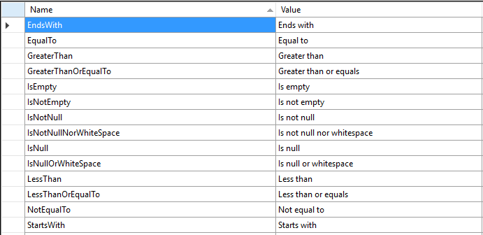
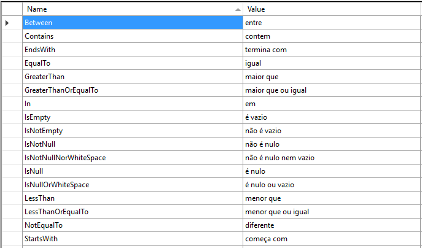

#  Expression Builder
In short words, this library basically provides you with a simple way to create lambda expressions to filter lists and database queries by delivering an easy-to-use fluent interface that enables the creation, storage and transmission of those filters. That can be used to help to turn WebApi requests parameters into expressions, create advanced search screens with the capability to save and re-run those filters, among other things.  If you would like more details on how it works, please, check out the article [Build Lambda Expression Dynamically](https://www.codeproject.com/Articles/1079028/Build-Lambda-Expressions-Dynamically).


* [Features](#features)
  * [New on version 2.0](#new-on-version-20)
* [How to use it](#how-to-use-it)
  * [Convetions](#conventions)
  * [Supported types/operations](#supported-typesoperations)
  * [Globalization support](#globalization-support)
  * [Complex expressions](#complex-expressions)
  * [Custom operations](#custom-operations)
* [License](#license)


# Features:
* Ability to reference properties by their names
* Ability to reference properties from a property
* Ability to reference properties from list items
* Built-in null-checks
* Built-in XML serialization
* Globalization support
* Support for complex expressions (those that group up statements within parenthesis)
* Ability to create your own custom operations

Would this help you in anyway? Well, if your answer is 'yes', you just made my day a bit better. :smile:

Please, feel free to leave comments and to place issues if you find errors or realize there is any missing feature.

## New on version 2.0:
* [Custom operations](#custom-operations): create your own operations or overwrite the behaviour of the default operations
* Enum renaming: **FilterStatementConnector** has changed to just **Connector**
* Other minor improvements

### Upgrading to version 2:
Below are a few notes on things you must take into account when upgrading from version 1 to version 2:
* The `Operation` enum was substituted by a class. So, you'll need to add a reference to the new namespace in order to use it: `using ExpressionBuilder.Operations;`
* Obtaining operations by their names:
<br />Before: `(Operation)Enum.Parse(typeof(Operation), "EqualTo")`
<br />Now: `Operation.GetByName("EqualTo")`
* Getting the number of values expected by an operation:
<br />Before: `new OperationHelper().NumberOfValuesAcceptable(Operation.EqualTo)`
<br />Now: `Operation.EqualTo.NumberOfValues`
* Connecting filter statements:
<br />Before: `FilterStatementConnector.And`
<br />Now: `Connector.And`

## New on version 1.1.2:
* New operation added: DoesNotContain
* [Support for complex expressions](/ExpressionBuilder/issues/10) (those that group up statements within parenthesis)
* Added tests using LINQ to SQL (along with a [bug fix regarding the library usage with LINQ to SQL](/ExpressionBuilder/issues/12))


# How to use it
Let us imagine we have classes like this...
```CSharp
public enum PersonGender
{
    Male,
    Female
}

public class Person
{
    public int Id { get; set; }
    public string Name { get; set; }
    public PersonGender Gender { get; set; }
    public BirthData Birth { get; set; }
    public List<Contact> Contacts { get; private set; }
    public Company Employer { get; set; }

    public class BirthData
    {
        public DateTime Date { get; set; }
        public string Country { get; set; }
    }

    public class Company {
        public string Name { get; set; }
        public string Industry { get; set; }
    }
}

public enum ContactType
{
    Telephone,
    Email
}

public class Contact
{
    public ContactType Type { get; set; }
    public string Value { get; set; }
    public string Comments { get; set; }
}
```
...and we have to build the code behind a form like this one to filter a list of Person objects:


Now, what about being able to do it in a way like this:
```CSharp
var filter = new Filter<Person>();
filter.By("Id", Operation.Between, 2, 4,  Connector.And);
filter.By("Contacts[Value]", Operation.EndsWith, "@email.com", default(string), Connector.And);
filter.By("Birth.Country", Operation.IsNotNull, default(string), default(string),  Connector.Or);
filter.By("Name", Operation.Contains, " John");
var people = People.Where(filter);

//or like this...

var filter = new Filter<Person>();
filter.By("Id", Operation.Between, 2, 4)
      .And.By("Birth.Country", Operation.IsNotNull)
      .And.By("Contacts[Value]", Operation.EndsWith, "@email.com")
      .Or.By("Name", Operation.Contains, " John ");
var people = People.Where(filter);
```
So that would generate an expression like this:
```CSharp
People.Where(p => (p.Id >= 2 && p.Id <= 4)
             && (p.Birth != null && p.Birth.Country != null)
             && (p.Contacts != null && p.Contacts.Any(c => c.Value.Trim().ToLower().EndsWith("@email.com")))
             || (p.Name != null  && p.Name.Trim().ToLower().Contains("john")));
```

## Conventions
The convention around the properties names is, probably, the heart of this project. It defines the way in which the properties are addressed, how to reference a property, or the property of a property, or even the property of an item in a list property of the type being filtered.

How to address a property:
1. *Any value property of the type being filtered:* just mention its name (e.g. `Id`, `Name`, `Gender`, etc.)
2. *Any value property of a reference property of the type being filtered:* use the "dot notation" (e.g. `Birth.Date`, `Company.Name`, etc.)
3. *Any value property of an item in a list property:* mention the name of the list property followed by the name of its property between brackets (e.g. `Contacts[Type]`, `Contacts[Value]`)

## Supported types/operations
The operations are grouped together into logical type groups to simplify the association of a type with an operation:
* Default
  * EqualTo
  * NotEqualTo
* Text
  * Contains
  * DoesNotContain
  * EndsWith
  * EqualTo
  * IsEmpty
  * IsNotEmpty
  * IsNotNull
  * IsNotNullNorWhiteSpace
  * IsNull
  * IsNullOrWhiteSpace
  * NotEqualTo
  * StartsWith
* Number
  * Between
  * EqualTo
  * GreaterThan
  * GreaterThanOrEqualTo
  * LessThan
  * LessThanOrEqualTo
  * NotEqualTo
* Boolean
  * EqualTo
  * NotEqualTo
* Date
  * Between
  * EqualTo
  * GreaterThan
  * GreaterThanOrEqualTo
  * LessThan
  * LessThanOrEqualTo
  * NotEqualTo

This way, when a type is associated with a type group, that type will "inherit" the list of supported operations from its group.

While compiling the filter into a lambda expression, the expression builder will validate if the selected operation is supported by the property's type and throw an exception if it's not. To overcome situations in which you would like to add support to a specific type, you may configure it by adding the following to your config file:
```Xml
<configuration>
  ...
  <configSections>
    <section name="ExpressionBuilder" type="ExpressionBuilder.Configuration.ExpressionBuilderConfig, ExpressionBuilder" />
  </configSections>

  ...

  <ExpressionBuilder>
    <SupportedTypes>
      <add typeGroup="Date" type="System.DateTimeOffset" />
    </SupportedTypes>
  </ExpressionBuilder>
  ...
</configuration>
```

## Globalization support
You just need to perform some easy steps to add globalization support to the UI:
1. Add a resource file to the project, naming it after the type you'll create your filter to (e.g. `Person.resx`);
2. Add one entry for each property you'd like to globalize following the conventions (previously mentioned), but replacing the dots (`.`) and the brackets (`[`, `]`) by underscores (`_`):  
`Person.resx`  
  
`Person.pt-BR.resx`  

3. You can globalize the operations on a similar way as well by adding a resources file named `Operations.resx`:  
`Operations.resx`  
  
`Operations.pt-BR.resx`  

4. For the properties, you'll instantiate a `PropertyCollection` : `new PropertyCollection(typeof(Person), Resources.Person.ResourceManager)`. That will give you a collection of objects with three members:
  * `Id`: The conventionalised property identifier (previously mentioned)
  * `Name`: The resources file matching value for the property id
  * `Info`: The `PropertyInfo` object for the property
5. And for the operations, you have an extension method: `Operation.GreaterThanOrEqualTo.GetDescription(Resources.Operations.ResourceManager)`.

#### Note on globalization
Any property or operation not mentioned at the resources files will be replaced by its conventionalised property identifier.

## Complex expressions
Complex expressions are handled basically by grouping up filter statements, like in the example below:
```CSharp
var filter = new Filter<Products>();
filter.By("SupplierID", Operation.EqualTo, 1);
filter.StartGroup();
filter.By("CategoryID", Operation.EqualTo, 1, connector: Connector.Or);
filter.By("CategoryID", Operation.EqualTo, 2);
var people = db.Products.Where(filter);

//or using the fluent interface...

var filter = new Filter<Products>();
filter.By("SupplierID", Operation.EqualTo, 1)
   .And
   .Group.By("CategoryID", Operation.EqualTo, 1).Or.By("CategoryID", Operation.EqualTo, 2);
var people = db.Products.Where(filter);
```

That would produce an expression like this:
```CSharp
db.Products
  .Where(p => p.SupplierID == 1 && (p.CategoryID == 1 || p.CategoryID == 2));
```

Every time you start a group that means all further statements will by at the same "parenthesis". You don't need to close any group as you would do with parenthesis, just start a new group whenever you need the subsequent statements to be "inside a parenthesis".

## Custom operations
This is a breakthrough feature that enables you to create your own operations, or even overwrite the behaviour of the existing default operations. For example, let us say that you would like to have an operation to be applied on dates that would filter based on today's day and month (to know whose birthday is today, or to see which bills are due today). To do that, you would need to go through just two simple steps:

1. Create your custom operation. An operation to do what was proposed on the previous example would look like this:
```CSharp
public class ThisDay : IOperation
    {
        // Your operation's name
        public string Name { get { return "ThisDay"; } }

        // TypeGroup(s) to which it applies
        public TypeGroup TypeGroup { get { return TypeGroup.Date; } }

        // Number of values demanded by your operation
        public int NumberOfValues { get { return 0; } }

        public bool Active { get; set; }

        // Flag to specify if your operation accepts lists as values
        public bool SupportsLists { get { return false; } }

        // Flag to specify if your operation supports null on its values
        public bool ExpectNullValues { get { return false; } }

        public ThisDay()
        {
            Active = true;
        }

        // This is where your operation's behaviour lives
        // In this example, we are checking if the property's day and month are the same as today's day and month
        public Expression GetExpression(MemberExpression member, ConstantExpression value1, ConstantExpression value2)
        {
            var today = DateTime.Today;
            var constantDay = Expression.Constant(today.Day);
            var constantMonth = Expression.Constant(today.Month);

            // Supporting nullable dates
            if (Nullable.GetUnderlyingType(member.Type) != null)
            {
                var memberValue = Expression.Property(member, "Value");
                var dayMemberValue = Expression.Property(memberValue, "Day");
                var monthMemberValue = Expression.Property(memberValue, "Month");
                return Expression.AndAlso(
                    Expression.Equal(dayMemberValue, constantDay),
                    Expression.Equal(monthMemberValue, constantMonth)
                    )
                    .AddNullCheck(member);
            }

            var dayMember = Expression.Property(member, "Day");
            var monthMember = Expression.Property(member, "Month");
            // e.g.: x => x.DateProperty.Day == 21 && x.DateProperty.Month == 3
            return Expression.AndAlso(
                Expression.Equal(dayMember, constantDay),
                Expression.Equal(monthMember, constantMonth)
                );
        }

        public override string ToString()
        {
            return Name;
        }
    }
```

2. Load your custom operation into the operations list for the Expression Builder. This should be done ONLY ONCE, and before you first ever try to use your custom operation.
```CSharp
ExpressionBuilder.Operations.Operation.LoadOperations(new List<IOperation> { new ThisDay(), new EqualTo() }, true);
```

You can see this custom operation in action by running the WinForms example project. And if you have any hard time creating your custom operations, please refer to my article [Build Lambda Expression Dynamically](https://www.codeproject.com/Articles/1079028/Build-Lambda-Expressions-Dynamically) for some insights on the subject.

# License
Copyright 2018 David Belmont

Licensed under the Apache License, Version 2.0 (the "License");
you may not use this file except in compliance with the License.
You may obtain a copy of the License at [LICENSE](LICENSE)

Unless required by applicable law or agreed to in writing, software
distributed under the License is distributed on an "AS IS" BASIS,
WITHOUT WARRANTIES OR CONDITIONS OF ANY KIND, either express or implied.
See the License for the specific language governing permissions and
limitations under the License.
